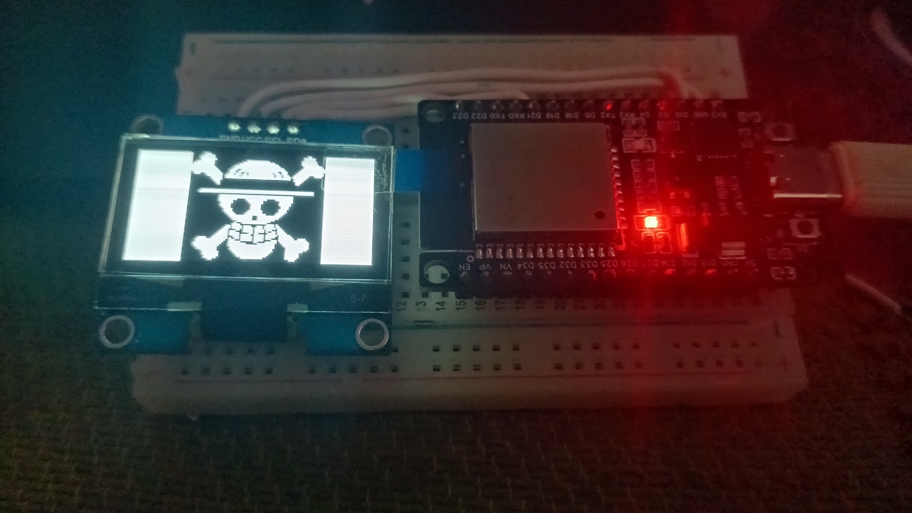

# Bit-Image Display on 1.3" OLED

This repository contains a simple Arduino code to display bit-images on a 1.3" I²C OLED.

**Features & Notes:**

* Works with **OLEDs of size 128×64**. The code is compatible with other sizes like 0.96", 1.8", or 2.1" without deviation.
* This code is for **I²C displays only**. Check your OLED connections for SDA and SCL. **Not for SPI displays.**
* Verify your **I²C address** (most commonly `0x3C` or `0x78`). A helper code is included in the repository to detect your display’s address.
* To convert images into bit-arrays for display, use [Image2CPP](https://javl.github.io/image2cpp/).
* Libraries required:

  * `Adafruit_GFX`
  * `Adafruit_SH110X`
    These are available in the Arduino Library Manager.

---

## I²C Pins Reference

| Board                    | SDA | SCL | Voltage |
| ------------------------ | --- | --- | ------- |
| Arduino Uno / Nano       | A4  | A5  | 5V      |
| Arduino Mega 2560        | 20  | 21  | 5V      |
| Arduino Leonardo / Micro | 2   | 3   | 5V      |
| Arduino Due              | 20  | 21  | 3.3V    |

| Board                             | SDA        | SCL        | Voltage |
| --------------------------------- | ---------- | ---------- | ------- |
| ESP32                             | GPIO21     | GPIO22     | 3.3V    |
| ESP8266 (NodeMCU / Wemos D1 Mini) | D2 (GPIO4) | D1 (GPIO5) | 3.3V    |
| STM32 (Blue Pill)                 | PB7        | PB6        | 3.3V    |

---

